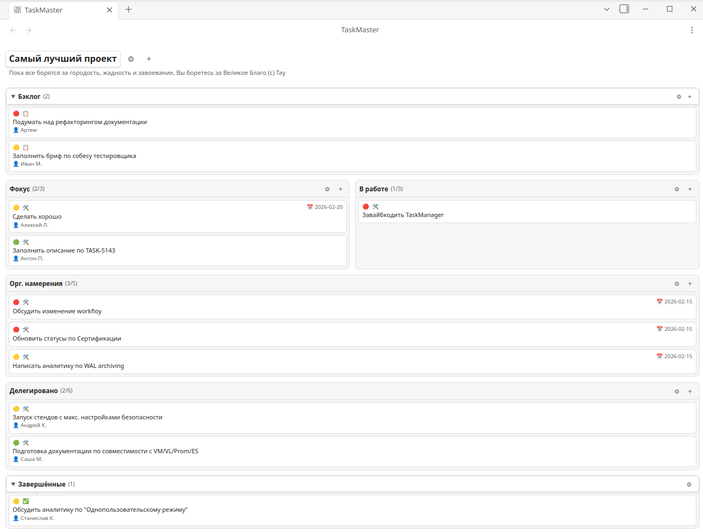

# TaskMaster для Obsidian

> [English version](README.md)

Плагин управления задачами для [Obsidian](https://obsidian.md) с карточками в стиле SMART и визуальной доской, разработанный для проектных менеджеров.



## Возможности

- **Визуальная доска** с 6 фиксированными группами: Бэклог, Фокус, В работе, Орг. намерения, Делегировано, Завершённые
- **SMART-карточки** со структурированными полями: Что, Зачем, Кто, Когда, Приоритет, Статус
- **Drag & drop** — перестановка карточек внутри групп и перемещение между группами
- **WIP-лимиты** — настраиваемые лимиты для каждой группы с визуальной индикацией перегрузки
- **Отмена удаления** — тост на 7 секунд с кнопкой отмены, до 3 тостов одновременно
- **Несколько досок** — отдельные доски для разных проектов или контекстов
- **Индикация просрочки** — красная рамка на карточках с истёкшим дедлайном
- **Автоочистка** — завершённые задачи автоматически удаляются по истечении настраиваемого срока хранения (по умолчанию 30 дней)
- **Переходы статусов** — автоматическая смена статуса при перемещении карточек между группами
- **Компактный вид карточек** — однострочный лейаут для плотных списков задач
- **Мультиколоночный лейаут** — отображение карточек в 4 колонки (full-width группы) или 2 колонки (half-width группы)
- **Поддержка тем** — использует CSS-переменные Obsidian, работает с любой темой (светлой/тёмной)

## Группы задач

| Группа | Назначение |
|--------|-----------|
| **Бэклог** | Входящие задачи, ещё не взятые в работу. Сворачиваемая, свёрнута по умолчанию |
| **Фокус** | Задачи, требующие пристального внимания прямо сейчас |
| **В работе** | Задачи, которые вы выполняете лично |
| **Орг. намерения** | Цели, запланированные на текущую неделю |
| **Делегировано** | Задачи, переданные коллегам, требующие периодической проверки |
| **Завершённые** | Архив выполненных задач с автоочисткой |

## Карточка задачи

Каждая задача содержит структурированные SMART-поля:

| Поле | Описание |
|------|----------|
| **Что** | Описание задачи (обязательное поле) |
| **Зачем** | Цель / ожидаемый результат |
| **Кто** | Исполнитель |
| **Когда** | Дедлайн |
| **Приоритет** | Низкий / Средний / Высокий |
| **Статус** | Новая / В работе / Ожидание / Завершена |

Индикаторы на карточке: иконка приоритета, иконка статуса, дедлайн, красная рамка просрочки, исполнитель.

## Почему TaskMaster?

Для Obsidian существует несколько плагинов управления задачами, но ни один из них не предлагает из коробки сочетание:

1. **Опционированная структура групп** — шесть целевых групп (Бэклог, Фокус, В работе, Орг. намерения, Делегировано, Завершённые) вместо произвольных колонок
2. **Карточки в стиле SMART** — структурированные поля (Что, Зачем, Кто, Когда, Приоритет, Статус) в каждой задаче, а не просто текст
3. **Визуальная доска с drag & drop** — перемещение карточек между группами с автоматическими переходами статусов

| Плагин / Инструмент | Визуальная доска | Структурированные поля | Фиксированная методология |
|---------------------|:---:|:---:|:---:|
| **TaskMaster** | + | + | + |
| Kanban (mgmeyers) | + | - | - |
| CardBoard (roovo) | + | - | - |
| Tasks (obsidian-tasks-group) | - | +/- | - |
| Projects (obsidian-projects) | + | - | - |
| Trello / Notion / ClickUp | + | + | - |

Ближайшие альтернативы требуют сборки из 2–3 плагинов (Tasks + Kanban + шаблоны) или использования облачных SaaS-решений. TaskMaster занимает свободную нишу — **опционированный, local-first инструмент** для проектного менеджера внутри Obsidian.

## Установка

### Ручная установка

1. Скачайте `main.js`, `manifest.json` и `styles.css` из [последнего релиза](../../releases/latest)
2. Создайте папку: `<vault>/.obsidian/plugins/obsidian-taskmaster/`
3. Скопируйте три файла в эту папку
4. Откройте Настройки Obsidian → Сторонние плагины → Включите «TaskMaster»

### Установка через BRAT

1. Установите плагин [BRAT](https://github.com/TfTHacker/obsidian42-brat)
2. В настройках BRAT нажмите «Add Beta Plugin»
3. Введите URL репозитория: `https://github.com/lesovsky/obsidian-taskmaster`
4. Включите плагин в настройках Сторонних плагинов

### Из реестра плагинов (скоро)

После регистрации в реестре community-плагинов Obsidian можно будет установить напрямую: Настройки → Сторонние плагины → Обзор.

## Разработка

### Требования

- [Node.js](https://nodejs.org) 18+
- npm

### Настройка

```bash
git clone https://github.com/lesovsky/obsidian-taskmaster.git
cd obsidian-taskmaster
npm install
```

### Сборка

```bash
# Разработка (watch-режим)
npm run dev

# Production-сборка
npm run build
```

Production-сборка создаёт `main.js` и `styles.css` в корне проекта.

### Создание релиза

```bash
npm run build
gh release create 0.1.0 main.js manifest.json styles.css --title "0.1.0" --notes "Initial release"
```

## Лицензия

[MIT](LICENSE)
